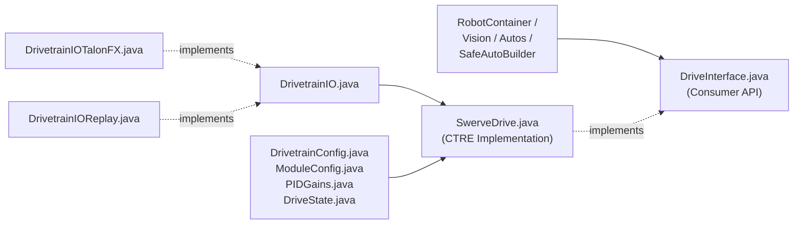

# 2. Swerve Drivetrain Library (`frc.lib.drivetrain`)

All swerve drivetrain classes live in [`src/main/java/frc/lib/drivetrain/`](https://github.com/FRC-Flux-Robotics/New_Robot/tree/main/src/main/java/frc/lib/drivetrain). Other subsystems and commands never depend on [`SwerveDrive`](https://github.com/FRC-Flux-Robotics/New_Robot/blob/main/src/main/java/frc/lib/drivetrain/SwerveDrive.java) directly—they program against [`DriveInterface`](https://github.com/FRC-Flux-Robotics/New_Robot/blob/main/src/main/java/frc/lib/drivetrain/DriveInterface.java).

---

## [`DriveInterface.java`](https://github.com/FRC-Flux-Robotics/New_Robot/blob/main/src/main/java/frc/lib/drivetrain/DriveInterface.java)
* **Source:** [`src/main/java/frc/lib/drivetrain/DriveInterface.java`](https://github.com/FRC-Flux-Robotics/New_Robot/blob/main/src/main/java/frc/lib/drivetrain/DriveInterface.java)
* **Why it exists:** Decouples commands, autonomous routines, and vision from the underlying CTRE Phoenix 6 hardware implementation. That allows unit tests to pass a lightweight mock/fake `DriveInterface` without needing physical motors.
* **What it does:** Declares the clean drivetrain contract:
  * **Movement:** `drive(xSpeed, ySpeed, rot, fieldRelative, periodSeconds)`, `driveFieldCentricFacingAngle(...)`, `setBrake()`, `setIdle()`
  * **Pose & State:** `getPose()`, `getVelocity()`, `getHeading()`, `getDriveState()`, `resetHeading()`, `resetPose(pose)`
  * **Vision & PathPlanner:** `addVisionMeasurement(visionPose, timestamp, stdDevs)`, `followPathCommand(pathName)`

---

## [`SwerveDrive.java`](https://github.com/FRC-Flux-Robotics/New_Robot/blob/main/src/main/java/frc/lib/drivetrain/SwerveDrive.java)
* **Source:** [`src/main/java/frc/lib/drivetrain/SwerveDrive.java`](https://github.com/FRC-Flux-Robotics/New_Robot/blob/main/src/main/java/frc/lib/drivetrain/SwerveDrive.java)
* **Why it exists:** Concrete CTRE Phoenix 6 swerve implementation of [`DriveInterface`](https://github.com/FRC-Flux-Robotics/New_Robot/blob/main/src/main/java/frc/lib/drivetrain/DriveInterface.java) for Kraken X60 drive/steer motors, CANcoders, and Pigeon 2 IMU.
* **What it does:**
  * Extends CTRE's `SwerveDrivetrain<TalonFX, TalonFX, CANcoder>` and configures current limits (`60A` stator / `120A` supply on drive, `60A` stator on steer), gear ratios, and PID gains from [`DrivetrainConfig`](https://github.com/FRC-Flux-Robotics/New_Robot/blob/main/src/main/java/frc/lib/drivetrain/DrivetrainConfig.java).
  * Pre-allocates reusable CTRE `SwerveRequest` objects (`FieldCentric`, `RobotCentric`, `FieldCentricFacingAngle`, `ApplyRobotSpeeds`, `SwerveDriveBrake`, `Idle`) so zero objects are allocated inside the 20 ms loop.
  * Configures **PathPlanner `AutoBuilder`** with a `PPHolonomicDriveController` for autonomous path following and alliance-aware path flipping.
  * Provides 3 **SysId characterization routines** (translation, steer, and rotation) capped at `4V` dynamic step to prevent brownouts.
  * Logs pose, velocity, and module states every cycle via [`DrivetrainIO`](https://github.com/FRC-Flux-Robotics/New_Robot/blob/main/src/main/java/frc/lib/drivetrain/DrivetrainIO.java) and AdvantageKit `Logger`.

---

## AdvantageKit Drivetrain IO Layer

| Class | Source Link | Why It Exists & What It Does |
| :--- | :--- | :--- |
| **`DrivetrainIO`** | [`DrivetrainIO.java`](https://github.com/FRC-Flux-Robotics/New_Robot/blob/main/src/main/java/frc/lib/drivetrain/DrivetrainIO.java) | Defines `@AutoLog class DrivetrainIOInputs` (`gyroYawDeg`, `gyroRateDegPerSec`, `batteryVoltage`, `driveCurrentA[4]`, `steerCurrentA[4]`, `moduleAngleDeg[4]`) so all drivetrain sensor signals are recorded into `.wpilog` files every 20 ms. |
| **`DrivetrainIOTalonFX`** | [`DrivetrainIOTalonFX.java`](https://github.com/FRC-Flux-Robotics/New_Robot/blob/main/src/main/java/frc/lib/drivetrain/DrivetrainIOTalonFX.java) | Real hardware implementation of [`DrivetrainIO`](https://github.com/FRC-Flux-Robotics/New_Robot/blob/main/src/main/java/frc/lib/drivetrain/DrivetrainIO.java). Registers all 14 drivetrain `StatusSignal` objects (2 Pigeon 2 gyro signals + 4 modules × 3 signals) with [`PhoenixSignals`](https://github.com/FRC-Flux-Robotics/New_Robot/blob/main/src/main/java/frc/lib/util/PhoenixSignals.java) for single-call batched CAN refreshing. |
| **`DrivetrainIOReplay`** | [`DrivetrainIOReplay.java`](https://github.com/FRC-Flux-Robotics/New_Robot/blob/main/src/main/java/frc/lib/drivetrain/DrivetrainIOReplay.java) | No-op implementation used in `Mode.REPLAY` when AdvantageKit injects logged sensor values from a `.wpilog` file. |

---

## Drivetrain Configuration & Data Records

| Class | Source Link | Why It Exists & What It Does |
| :--- | :--- | :--- |
| **`DrivetrainConfig`** | [`DrivetrainConfig.java`](https://github.com/FRC-Flux-Robotics/New_Robot/blob/main/src/main/java/frc/lib/drivetrain/DrivetrainConfig.java) | Immutable configuration object with a fluent `Builder` that holds CAN bus name, Pigeon 2 ID, all 4 [`ModuleConfig`](https://github.com/FRC-Flux-Robotics/New_Robot/blob/main/src/main/java/frc/lib/drivetrain/ModuleConfig.java) corners, gear ratios, wheel radius, max speed/angular rate, [`PIDGains`](https://github.com/FRC-Flux-Robotics/New_Robot/blob/main/src/main/java/frc/lib/drivetrain/PIDGains.java), current limits, track dimensions, and `List<CameraConfig>`. |
| **`ModuleConfig`** | [`ModuleConfig.java`](https://github.com/FRC-Flux-Robotics/New_Robot/blob/main/src/main/java/frc/lib/drivetrain/ModuleConfig.java) | Holds the per-corner hardware settings for one swerve module: `driveMotorId`, `steerMotorId`, `encoderId` (CANcoder), `encoderOffset` (in rotations), `(xPosInches, yPosInches)` relative to robot center, and `invertDrive` / `invertSteer` flags. |
| **`PIDGains`** | [`PIDGains.java`](https://github.com/FRC-Flux-Robotics/New_Robot/blob/main/src/main/java/frc/lib/drivetrain/PIDGains.java) | Compact value object storing closed-loop PID and feedforward gains (`kP`, `kI`, `kD`, `kS`, `kV`, `kA`) shared by both swerve modules and mechanisms. |
| **`DriveState`** | [`DriveState.java`](https://github.com/FRC-Flux-Robotics/New_Robot/blob/main/src/main/java/frc/lib/drivetrain/DriveState.java) | Snapshot of current drivetrain state (`Pose2d`, `ChassisSpeeds`, module states/positions, and odometry period) returned by `DriveInterface.getDriveState()`. |
