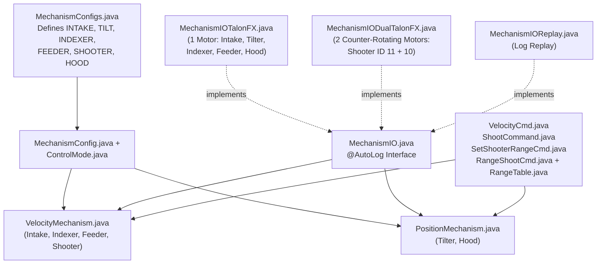

# 3. Mechanisms & Shooting (`frc.lib.mechanism` & `frc.robot`)

Instead of writing separate subsystem classes for every motor on the robot, [`New_Robot`](https://github.com/FRC-Flux-Robotics/New_Robot) uses **two universal mechanism classes** in [`src/main/java/frc/lib/mechanism/`](https://github.com/FRC-Flux-Robotics/New_Robot/tree/main/src/main/java/frc/lib/mechanism) configured by [`MechanismConfigs.java`](https://github.com/FRC-Flux-Robotics/New_Robot/blob/main/src/main/java/frc/robot/MechanismConfigs.java) and controlled by reusable commands in [`src/main/java/frc/robot/commands/`](https://github.com/FRC-Flux-Robotics/New_Robot/tree/main/src/main/java/frc/robot/commands).

---

## Reusable Mechanism Subsystems (`frc.lib.mechanism`)

### [`VelocityMechanism.java`](https://github.com/FRC-Flux-Robotics/New_Robot/blob/main/src/main/java/frc/lib/mechanism/VelocityMechanism.java)
* **Source:** [`src/main/java/frc/lib/mechanism/VelocityMechanism.java`](https://github.com/FRC-Flux-Robotics/New_Robot/blob/main/src/main/java/frc/lib/mechanism/VelocityMechanism.java)
* **Why it exists:** Universal subsystem for any roller, wheel, belt, or flywheel controlled by target speed in **Rotations Per Second (`RPS`)**. Used for **4 subsystems on `FUEL`**: `intake`, `indexer`, `feeder`, and `shooter`.
* **What it does:**
  * Calls `m_io.updateInputs(m_inputs)` and `Logger.processInputs(m_config.name, m_inputs)` every 20 ms, plus logs `TargetVelocity` and `AtTarget`.
  * Exposes `setVelocity(velocityRPS)`, `stop()`, `getVelocity()`, and `atTarget()` (returns `true` when `|currentVelocity - targetVelocity| <= tolerance`).

### [`PositionMechanism.java`](https://github.com/FRC-Flux-Robotics/New_Robot/blob/main/src/main/java/frc/lib/mechanism/PositionMechanism.java)
* **Source:** [`src/main/java/frc/lib/mechanism/PositionMechanism.java`](https://github.com/FRC-Flux-Robotics/New_Robot/blob/main/src/main/java/frc/lib/mechanism/PositionMechanism.java)
* **Why it exists:** Universal subsystem for any pivot, arm, elevator, or hood controlled to a target angle/position in **motor rotations (`rot`)**. Used for **2 subsystems on `FUEL`**: `tilter` (intake pivot) and `hood` (shooter elevation).
* **What it does:**
  * Logs `TargetPosition` and `AtTarget` via AdvantageKit every 20 ms.
  * Exposes `setPosition(positionRotations)` (automatically uses MotionMagic if configured, or standard closed-loop `PositionVoltage`), `jogUp()`, `jogDown()`, `stop()`, `resetPosition()`, and `atTarget()`.

---

## AdvantageKit Mechanism IO Layer (`frc.lib.mechanism`)

| Class | Source Link | Why It Exists & What It Does |
| :--- | :--- | :--- |
| **`MechanismIO`** | [`MechanismIO.java`](https://github.com/FRC-Flux-Robotics/New_Robot/blob/main/src/main/java/frc/lib/mechanism/MechanismIO.java) | Hardware abstraction interface defining `@AutoLog class MechanismIOInputs` (`positionRotations`, `velocityRPS`, `statorCurrentA`, `supplyCurrentA`, `appliedVoltage`, `tempCelsius`, `motorConnected`) and control methods (`setPosition`, `setMotionMagicPosition`, `setVelocity`, `stop`, `resetPosition`). |
| **`MechanismIOTalonFX`** | [`MechanismIOTalonFX.java`](https://github.com/FRC-Flux-Robotics/New_Robot/blob/main/src/main/java/frc/lib/mechanism/MechanismIOTalonFX.java) | Real single-motor CTRE `TalonFX` implementation. Applies PID/feedforward gains, voltage limits, supply/stator current limits, and hardware soft limits from [`MechanismConfig`](https://github.com/FRC-Flux-Robotics/New_Robot/blob/main/src/main/java/frc/lib/mechanism/MechanismConfig.java) (with 5-attempt retry via [`PhoenixUtil`](https://github.com/FRC-Flux-Robotics/New_Robot/blob/main/src/main/java/frc/lib/util/PhoenixUtil.java)), and registers status signals with [`PhoenixSignals`](https://github.com/FRC-Flux-Robotics/New_Robot/blob/main/src/main/java/frc/lib/util/PhoenixSignals.java). |
| **`MechanismIODualTalonFX`** | [`MechanismIODualTalonFX.java`](https://github.com/FRC-Flux-Robotics/New_Robot/blob/main/src/main/java/frc/lib/mechanism/MechanismIODualTalonFX.java) | Real dual-motor `TalonFX` implementation (used by `FUEL`'s dual shooter: Leader ID `11` + Follower ID `10`). Supports both aligned followers and counter-rotating (`Opposed`) followers, averaging velocity and summing currents across both motors. |
| **`MechanismIOReplay`** | [`MechanismIOReplay.java`](https://github.com/FRC-Flux-Robotics/New_Robot/blob/main/src/main/java/frc/lib/mechanism/MechanismIOReplay.java) | No-op implementation used during AdvantageKit log replay (`Mode.REPLAY`). |
| **`MechanismConfig` & `ControlMode`** | [`MechanismConfig.java`](https://github.com/FRC-Flux-Robotics/New_Robot/blob/main/src/main/java/frc/lib/mechanism/MechanismConfig.java) [`ControlMode.java`](https://github.com/FRC-Flux-Robotics/New_Robot/blob/main/src/main/java/frc/lib/mechanism/ControlMode.java) | Immutable builder configuration (`name`, `motorId`, `secondMotorId`, `canBus`, `pidGains`, `ControlMode.POSITION` or `VELOCITY`, `peakVoltage`, `supplyCurrentLimit`, `statorCurrentLimit`, `jogStep`, `softLimitForward`, `softLimitReverse`, MotionMagic parameters). |

---

## `FUEL` Mechanism Configs, Tuning & Shooting (`frc.robot` & `frc.robot.commands`)

| Class | Source Link | Why It Exists & What It Does |
| :--- | :--- | :--- |
| **`MechanismConfigs`** | [`MechanismConfigs.java`](https://github.com/FRC-Flux-Robotics/New_Robot/blob/main/src/main/java/frc/robot/MechanismConfigs.java) | Declares the 6 static [`MechanismConfig`](https://github.com/FRC-Flux-Robotics/New_Robot/blob/main/src/main/java/frc/lib/mechanism/MechanismConfig.java) definitions on the `"Mech"` CANivore bus for `FUEL`: `INTAKE` (ID `1`), `TILT` (ID `20`), `INDEXER` (ID `4`), `FEEDER` (ID `3`), `SHOOTER` (IDs `11` & `10`), and `HOOD` (ID `12`). |
| **`MechanismTuning`** | [`MechanismTuning.java`](https://github.com/FRC-Flux-Robotics/New_Robot/blob/main/src/main/java/frc/robot/MechanismTuning.java) | Publishes live-tunable mechanism speeds and hood/tilter positions to the `Tuning` tab in Elastic (`Tuning/IntakeInRPS`, `IndexerRPS`, `FeederRPS`, `ShooterDefaultRPS`, `HoodShort`, `HoodMid`, `HoodLong`, and `Save` button to persist to RoboRIO `Preferences`). |
| **`RangeTable`** | [`RangeTable.java`](https://github.com/FRC-Flux-Robotics/New_Robot/blob/main/src/main/java/frc/robot/RangeTable.java) | Lookup table mapping distance from the scoring Hub (in meters) to `(speed, elevation)` for the shooter and hood. |
| **`VelocityCmd`** | [`VelocityCmd.java`](https://github.com/FRC-Flux-Robotics/New_Robot/blob/main/src/main/java/frc/robot/commands/VelocityCmd.java) | Runs any [`VelocityMechanism`](https://github.com/FRC-Flux-Robotics/New_Robot/blob/main/src/main/java/frc/lib/mechanism/VelocityMechanism.java) (`intake`, `indexer`, `feeder`) at a supplied `DoubleSupplier` speed (RPS) while held or until an optional timeout, then calls `stop()` in `end()`. |
| **`ShootCommand`** | [`ShootCommand.java`](https://github.com/FRC-Flux-Robotics/New_Robot/blob/main/src/main/java/frc/robot/commands/ShootCommand.java) | Spins up the `shooter` [`VelocityMechanism`](https://github.com/FRC-Flux-Robotics/New_Robot/blob/main/src/main/java/frc/lib/mechanism/VelocityMechanism.java) to a target RPS and stops it when cancelled or toggled off. |
| **`SetShooterRangeCmd`** | [`SetShooterRangeCmd.java`](https://github.com/FRC-Flux-Robotics/New_Robot/blob/main/src/main/java/frc/robot/commands/SetShooterRangeCmd.java) | Sets both `shooter` velocity (RPS) and `hood` angle (rotations) to the Short (`0`), Medium (`1`), or Long (`2`) preset from [`MechanismTuning`](https://github.com/FRC-Flux-Robotics/New_Robot/blob/main/src/main/java/frc/robot/MechanismTuning.java); stops the shooter and returns the hood to `0` when toggled off. |
| **`RangeShootCmd`** | [`RangeShootCmd.java`](https://github.com/FRC-Flux-Robotics/New_Robot/blob/main/src/main/java/frc/robot/commands/RangeShootCmd.java) | Full automatic distance-based shooting command: calculates distance from `drive.getPose()` to [`FieldPositions.resolve("HUB")`](https://github.com/FRC-Flux-Robotics/New_Robot/blob/main/src/main/java/frc/robot/FieldPositions.java), sets `shooter` RPS and `hood` elevation from [`RangeTable`](https://github.com/FRC-Flux-Robotics/New_Robot/blob/main/src/main/java/frc/robot/RangeTable.java), and **waits until `m_shooter.atTarget()` is true** before running `feeder` and `indexer`. |
