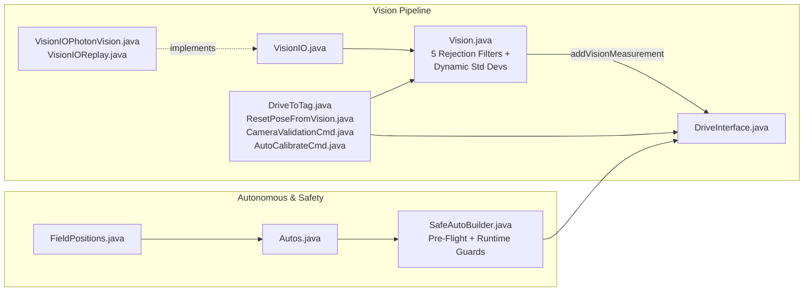

# 4. Vision, Autonomous & Shared Utilities

These classes handle **multi-camera AprilTag localization**, **camera calibration**, **safe PathPlanner autonomous execution**, and **low-level CAN batching & logging**.

---

## Multi-Camera Vision (`frc.robot` & `frc.lib.vision`)

### [`Vision.java`](https://github.com/FRC-Flux-Robotics/New_Robot/blob/main/src/main/java/frc/robot/Vision.java)
* **Source:** [`src/main/java/frc/robot/Vision.java`](https://github.com/FRC-Flux-Robotics/New_Robot/blob/main/src/main/java/frc/robot/Vision.java)
* **Why it exists:** Processes AprilTag pose observations from 1 to 3 cameras, filters out bad frames, scales measurement uncertainty ($\sigma$) based on tag count and distance, and feeds accepted poses into the drivetrain's pose estimator.
* **What it does:**
  * Reads `@AutoLog` inputs from every [`VisionIO`](https://github.com/FRC-Flux-Robotics/New_Robot/blob/main/src/main/java/frc/lib/vision/VisionIO.java) instance and logs them via AdvantageKit.
  * Runs **5 rejection filters** defined in [`VisionRejectReason.java`](https://github.com/FRC-Flux-Robotics/New_Robot/blob/main/src/main/java/frc/robot/VisionRejectReason.java):
    1. `TOO_AMBIGUOUS` (single-tag ambiguity $> 0.30$)
    2. `OUT_OF_FIELD` (pose $> 0.5\text{ m}$ outside the $16.54\text{ m} \times 8.21\text{ m}$ field)
    3. `Z_ERROR` (estimated height $|Z| > 0.75\text{ m}$ off the carpet)
    4. `ANGULAR_VEL_TOO_HIGH` (robot spinning $> 120^\circ/\text{s}$)
    5. `MOVING_TOO_FAST` (robot translating $> 3.0\text{ m/s}$)
  * Computes dynamic standard deviations ($\sigma \propto \text{distance}^2 / \text{tagCount}$) and calls `m_drive.addVisionMeasurement(...)`.
  * Publishes live camera identification (`CamID/`), inter-camera disagreement (`Vision/CameraDisagreementMeters`), and live 6-DOF transform tuning (`CamTune/`) to Elastic.

### Vision IO & Calibration Classes

| Class | Source Link | Why It Exists & What It Does |
| :--- | :--- | :--- |
| **`VisionIO`** | [`VisionIO.java`](https://github.com/FRC-Flux-Robotics/New_Robot/blob/main/src/main/java/frc/lib/vision/VisionIO.java) | Hardware abstraction interface defining `@AutoLog class VisionIOInputs` (`connected`, `posePresent`, `poseX/Y/Z/RotRadians`, `poseTimestamp`, `targetFiducialIds[]`, `targetPoseAmbiguities[]`, `bestTargetId/Yaw/Area`). |
| **`VisionIOPhotonVision`** | [`VisionIOPhotonVision.java`](https://github.com/FRC-Flux-Robotics/New_Robot/blob/main/src/main/java/frc/lib/vision/VisionIOPhotonVision.java) | Real camera implementation using `PhotonCamera` and `PhotonPoseEstimator` (`MULTI_TAG_PNP_ON_COPROCESSOR` with `LOWEST_AMBIGUITY` fallback). Tracks camera disconnect status if 50 consecutive cycles (~1.0s) have no frames. |
| **`VisionIOReplay`** | [`VisionIOReplay.java`](https://github.com/FRC-Flux-Robotics/New_Robot/blob/main/src/main/java/frc/lib/vision/VisionIOReplay.java) | No-op implementation used during AdvantageKit log replay (`Mode.REPLAY`). |
| **`CameraConfig`** | [`CameraConfig.java`](https://github.com/FRC-Flux-Robotics/New_Robot/blob/main/src/main/java/frc/lib/drivetrain/CameraConfig.java) | Record holding a camera's PhotonVision name (`"OV9281-1"`, etc.) and its 3D mounting offset (`Transform3d robotToCamera`). |
| **`VisionRejectReason`** | [`VisionRejectReason.java`](https://github.com/FRC-Flux-Robotics/New_Robot/blob/main/src/main/java/frc/robot/VisionRejectReason.java) | Enum of the 5 vision rejection reasons tracked per camera on the dashboard. |
| **`DriveToTag`** | [`DriveToTag.java`](https://github.com/FRC-Flux-Robotics/New_Robot/blob/main/src/main/java/frc/robot/DriveToTag.java) | Proportional approach command that rotates the robot toward `vision.getBestYaw()` and drives forward until `vision.getBestArea()` reaches the target area (`8%`). |
| **`ResetPoseFromVision`** | [`ResetPoseFromVision.java`](https://github.com/FRC-Flux-Robotics/New_Robot/blob/main/src/main/java/frc/robot/commands/ResetPoseFromVision.java) | Triggered from the Elastic dashboard (`Vision Reset` button): collects 3 pose samples from each connected camera, averages $(X, Y)$ and circular heading $(\sin/\cos)$, and calls `drive.resetPose(avg)`. |
| **`CameraValidationCmd`** | [`CameraValidationCmd.java`](https://github.com/FRC-Flux-Robotics/New_Robot/blob/main/src/main/java/frc/robot/commands/CameraValidationCmd.java) | Self-referencing 3-station × 4-rotation ($0^\circ/90^\circ/180^\circ/270^\circ$) field calibration routine (~45s). Detects $(\Delta X, \Delta Y)$ mounting offset errors from rotational self-consistency and $\Delta\text{Yaw}$ errors from odometry vs. vision displacement between stations. |
| **`AutoCalibrateCmd`** | [`AutoCalibrateCmd.java`](https://github.com/FRC-Flux-Robotics/New_Robot/blob/main/src/main/java/frc/robot/commands/AutoCalibrateCmd.java) | Runs [`CameraValidationCmd`](https://github.com/FRC-Flux-Robotics/New_Robot/blob/main/src/main/java/frc/robot/commands/CameraValidationCmd.java) in a closed loop (up to 3 passes), automatically applying the computed $(\Delta X, \Delta Y, \Delta\text{Yaw})$ corrections between passes until all cameras pass validation. |

---

## Autonomous & Field Coordinates (`frc.robot`)

| Class | Source Link | Why It Exists & What It Does |
| :--- | :--- | :--- |
| **`Autos`** | [`Autos.java`](https://github.com/FRC-Flux-Robotics/New_Robot/blob/main/src/main/java/frc/robot/Autos.java) | Factory class containing all autonomous routines (`none`, `driveForward`, `precisionSquare`, `driveToNearestTag`, `hubToDepot`, `leftToDepot`, `rightToDepot`, `cameraValidation`, `autoCalibrate`). |
| **`SafeAutoBuilder`** | [`SafeAutoBuilder.java`](https://github.com/FRC-Flux-Robotics/New_Robot/blob/main/src/main/java/frc/robot/SafeAutoBuilder.java) | Wraps every PathPlanner trajectory with **pre-flight checks** (verifies starting pose is within `1.0m` of path start, velocity is within limits and above deadband) and **runtime safety guards** (automatically cancels the path if path tracking error exceeds `2.0m`, speed overshoots by $>30\%$, or a $>10\text{ m/s}^2$ collision deceleration is detected). |
| **`FieldPositions`** | [`FieldPositions.java`](https://github.com/FRC-Flux-Robotics/New_Robot/blob/main/src/main/java/frc/robot/FieldPositions.java) | Stores named field coordinates (`Origin`, `Left`, `Right`, `HUB`) in Blue-alliance coordinates and automatically mirrors them for the Red alliance via `FieldPositions.resolve(name)` and `isRedAlliance()`. |

---

## Shared Utilities (`frc.lib.util` & `frc.robot.util`)

| Class | Source Link | Why It Exists & What It Does |
| :--- | :--- | :--- |
| **`PhoenixSignals`** | [`PhoenixSignals.java`](https://github.com/FRC-Flux-Robotics/New_Robot/blob/main/src/main/java/frc/lib/util/PhoenixSignals.java) | Central CAN status signal registry. Groups all registered CTRE `BaseStatusSignal` objects by CAN bus name (`"Drivetrain"`, `"Mech"`) and refreshes each bus in a single `BaseStatusSignal.refreshAll(busSignals)` call at the top of `Robot.robotPeriodic()`, eliminating per-motor CAN round-trip overhead. |
| **`PhoenixUtil`** | [`PhoenixUtil.java`](https://github.com/FRC-Flux-Robotics/New_Robot/blob/main/src/main/java/frc/lib/util/PhoenixUtil.java) | Retry helper (`retryConfig`) that attempts CTRE motor configuration calls up to 5 times until `StatusCode.isOK()` succeeds, preventing silent config drops at boot. |
| **`LogFileManager`** | [`LogFileManager.java`](https://github.com/FRC-Flux-Robotics/New_Robot/blob/main/src/main/java/frc/lib/util/LogFileManager.java) | Resolves the `.wpilog` output directory (`/U/logs` on USB stick if present, otherwise `/home/lvuser/logs`) and automatically deletes the oldest log files if free disk space drops below safety thresholds. |
| **`LoggedTracer`** | [`LoggedTracer.java`](https://github.com/FRC-Flux-Robotics/New_Robot/blob/main/src/main/java/frc/lib/util/LoggedTracer.java) | Microsecond loop-time profiler that logs how many milliseconds `Commands` and `Periodic` take each cycle (`LoggedTracer/CommandsMS`, `LoggedTracer/PeriodicMS`) so we can spot 20 ms loop overruns. |
| **`Elastic`** | [`Elastic.java`](https://github.com/FRC-Flux-Robotics/New_Robot/blob/main/src/main/java/frc/robot/util/Elastic.java) | Publishes JSON popup notifications (`Elastic.sendNotification(...)`) and remote tab-switching requests (`Elastic.selectTab(...)`) to the Elastic Dashboard over NetworkTables (`/Elastic/RobotNotifications`). |
