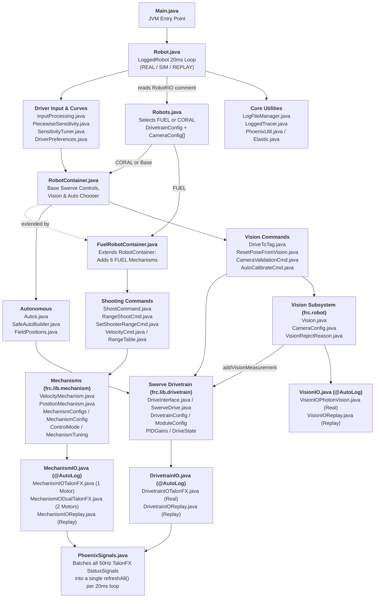

---
hide:
  - toc
---

# `New_Robot` Code Explainer — Architecture & Class Map

Welcome to the software architecture guide for **[`New_Robot`](https://github.com/FRC-Flux-Robotics/New_Robot)** (FRC Team 10413 FLUX Robotics — 2026 Season).

This guide explains **every Java class in the repository**, **why it exists**, **what it does during a match**, and **how all the classes connect together**—with direct links to the source code on GitHub.

---

## 1. Overall Class Relationship Diagram

The diagram below shows how all 38 Java classes in [`New_Robot/src/main/java/frc/`](https://github.com/FRC-Flux-Robotics/New_Robot/tree/main/src/main/java/frc) flow from **JVM Boot** at the top down to **AdvantageKit `*IO` Hardware & CAN Batching** at the bottom. Each of the 4 module pages linked below also includes a zoomed-in diagram for that specific package.

---

## 2. Why `New_Robot` Is Designed This Way (3 Core Principles)

1. **`frc.lib.*` (Reusable Library) vs. `frc.robot.*` (Season/Robot Logic):**
   * **[`src/main/java/frc/lib/`](https://github.com/FRC-Flux-Robotics/New_Robot/tree/main/src/main/java/frc/lib)** contains reusable swerve, vision, mechanism, and CAN batching building blocks that do not hardcode any specific game year or CAN ID.
   * **[`src/main/java/frc/robot/`](https://github.com/FRC-Flux-Robotics/New_Robot/tree/main/src/main/java/frc/robot)** contains the specific robot configs (`FUEL` vs. `CORAL`), controller bindings, field coordinates, and autonomous routines.
2. **AdvantageKit `*IO` Hardware Abstraction (`REAL` / `SIM` / `REPLAY`):**
   * Subsystems (`SwerveDrive`, `Vision`, `PositionMechanism`, `VelocityMechanism`) never read hardware sensors directly in their logic. Instead, they read an `@AutoLog` `*IOInputs` object populated by `*IOTalonFX` / `*IOPhotonVision` on the real robot or `*IOReplay` when replaying a `.wpilog` match file on a laptop.
3. **Config-Driven Subsystems (Zero Copy-Paste Subsystems):**
   * Instead of creating 6 separate classes for `IntakeSubsystem`, `TilterSubsystem`, `IndexerSubsystem`, `FeederSubsystem`, `ShooterSubsystem`, and `HoodSubsystem`, **all 6 mechanisms on `FUEL`** are instances of just two classes—[`VelocityMechanism`](https://github.com/FRC-Flux-Robotics/New_Robot/blob/main/src/main/java/frc/lib/mechanism/VelocityMechanism.java) and [`PositionMechanism`](https://github.com/FRC-Flux-Robotics/New_Robot/blob/main/src/main/java/frc/lib/mechanism/PositionMechanism.java)—configured in [`MechanismConfigs.java`](https://github.com/FRC-Flux-Robotics/New_Robot/blob/main/src/main/java/frc/robot/MechanismConfigs.java).

---

## 3. Class-by-Class Explainer Pages

Click into each module below for a detailed breakdown of every class, why it exists, what it does, a zoomed-in module diagram, and links to its source file on GitHub:

| Module Page | Classes Covered |
| :--- | :--- |
| **[1. Boot, Robot Configs & Containers](classes/robot-and-containers.md)** | [`Main.java`](https://github.com/FRC-Flux-Robotics/New_Robot/blob/main/src/main/java/frc/robot/Main.java), [`Robot.java`](https://github.com/FRC-Flux-Robotics/New_Robot/blob/main/src/main/java/frc/robot/Robot.java), [`Robots.java`](https://github.com/FRC-Flux-Robotics/New_Robot/blob/main/src/main/java/frc/robot/Robots.java), [`RobotContainer.java`](https://github.com/FRC-Flux-Robotics/New_Robot/blob/main/src/main/java/frc/robot/RobotContainer.java), [`FuelRobotContainer.java`](https://github.com/FRC-Flux-Robotics/New_Robot/blob/main/src/main/java/frc/robot/FuelRobotContainer.java), [`PiecewiseSensitivity.java`](https://github.com/FRC-Flux-Robotics/New_Robot/blob/main/src/main/java/frc/robot/PiecewiseSensitivity.java), [`SensitivityTuner.java`](https://github.com/FRC-Flux-Robotics/New_Robot/blob/main/src/main/java/frc/robot/SensitivityTuner.java), [`InputProcessing.java`](https://github.com/FRC-Flux-Robotics/New_Robot/blob/main/src/main/java/frc/robot/InputProcessing.java), [`DriverPreferences.java`](https://github.com/FRC-Flux-Robotics/New_Robot/blob/main/src/main/java/frc/robot/DriverPreferences.java) |
| **[2. Swerve Drivetrain Library](classes/drivetrain.md)** | [`DriveInterface.java`](https://github.com/FRC-Flux-Robotics/New_Robot/blob/main/src/main/java/frc/lib/drivetrain/DriveInterface.java), [`SwerveDrive.java`](https://github.com/FRC-Flux-Robotics/New_Robot/blob/main/src/main/java/frc/lib/drivetrain/SwerveDrive.java), [`DrivetrainIO.java`](https://github.com/FRC-Flux-Robotics/New_Robot/blob/main/src/main/java/frc/lib/drivetrain/DrivetrainIO.java), [`DrivetrainIOTalonFX.java`](https://github.com/FRC-Flux-Robotics/New_Robot/blob/main/src/main/java/frc/lib/drivetrain/DrivetrainIOTalonFX.java), [`DrivetrainIOReplay.java`](https://github.com/FRC-Flux-Robotics/New_Robot/blob/main/src/main/java/frc/lib/drivetrain/DrivetrainIOReplay.java), [`DrivetrainConfig.java`](https://github.com/FRC-Flux-Robotics/New_Robot/blob/main/src/main/java/frc/lib/drivetrain/DrivetrainConfig.java), [`ModuleConfig.java`](https://github.com/FRC-Flux-Robotics/New_Robot/blob/main/src/main/java/frc/lib/drivetrain/ModuleConfig.java), [`PIDGains.java`](https://github.com/FRC-Flux-Robotics/New_Robot/blob/main/src/main/java/frc/lib/drivetrain/PIDGains.java), [`DriveState.java`](https://github.com/FRC-Flux-Robotics/New_Robot/blob/main/src/main/java/frc/lib/drivetrain/DriveState.java) |
| **[3. Mechanisms & Shooting](classes/mechanisms.md)** | [`VelocityMechanism.java`](https://github.com/FRC-Flux-Robotics/New_Robot/blob/main/src/main/java/frc/lib/mechanism/VelocityMechanism.java), [`PositionMechanism.java`](https://github.com/FRC-Flux-Robotics/New_Robot/blob/main/src/main/java/frc/lib/mechanism/PositionMechanism.java), [`MechanismIO.java`](https://github.com/FRC-Flux-Robotics/New_Robot/blob/main/src/main/java/frc/lib/mechanism/MechanismIO.java), [`MechanismIOTalonFX.java`](https://github.com/FRC-Flux-Robotics/New_Robot/blob/main/src/main/java/frc/lib/mechanism/MechanismIOTalonFX.java), [`MechanismIODualTalonFX.java`](https://github.com/FRC-Flux-Robotics/New_Robot/blob/main/src/main/java/frc/lib/mechanism/MechanismIODualTalonFX.java), [`MechanismIOReplay.java`](https://github.com/FRC-Flux-Robotics/New_Robot/blob/main/src/main/java/frc/lib/mechanism/MechanismIOReplay.java), [`MechanismConfig.java`](https://github.com/FRC-Flux-Robotics/New_Robot/blob/main/src/main/java/frc/lib/mechanism/MechanismConfig.java), [`ControlMode.java`](https://github.com/FRC-Flux-Robotics/New_Robot/blob/main/src/main/java/frc/lib/mechanism/ControlMode.java), [`MechanismConfigs.java`](https://github.com/FRC-Flux-Robotics/New_Robot/blob/main/src/main/java/frc/robot/MechanismConfigs.java), [`MechanismTuning.java`](https://github.com/FRC-Flux-Robotics/New_Robot/blob/main/src/main/java/frc/robot/MechanismTuning.java), [`RangeTable.java`](https://github.com/FRC-Flux-Robotics/New_Robot/blob/main/src/main/java/frc/robot/RangeTable.java), [`VelocityCmd.java`](https://github.com/FRC-Flux-Robotics/New_Robot/blob/main/src/main/java/frc/robot/commands/VelocityCmd.java), [`ShootCommand.java`](https://github.com/FRC-Flux-Robotics/New_Robot/blob/main/src/main/java/frc/robot/commands/ShootCommand.java), [`SetShooterRangeCmd.java`](https://github.com/FRC-Flux-Robotics/New_Robot/blob/main/src/main/java/frc/robot/commands/SetShooterRangeCmd.java), [`RangeShootCmd.java`](https://github.com/FRC-Flux-Robotics/New_Robot/blob/main/src/main/java/frc/robot/commands/RangeShootCmd.java) |
| **[4. Vision, Autonomous & Utilities](classes/vision-autos-and-util.md)** | [`Vision.java`](https://github.com/FRC-Flux-Robotics/New_Robot/blob/main/src/main/java/frc/robot/Vision.java), [`VisionRejectReason.java`](https://github.com/FRC-Flux-Robotics/New_Robot/blob/main/src/main/java/frc/robot/VisionRejectReason.java), [`CameraConfig.java`](https://github.com/FRC-Flux-Robotics/New_Robot/blob/main/src/main/java/frc/lib/drivetrain/CameraConfig.java), [`VisionIO.java`](https://github.com/FRC-Flux-Robotics/New_Robot/blob/main/src/main/java/frc/lib/vision/VisionIO.java), [`VisionIOPhotonVision.java`](https://github.com/FRC-Flux-Robotics/New_Robot/blob/main/src/main/java/frc/lib/vision/VisionIOPhotonVision.java), [`VisionIOReplay.java`](https://github.com/FRC-Flux-Robotics/New_Robot/blob/main/src/main/java/frc/lib/vision/VisionIOReplay.java), [`DriveToTag.java`](https://github.com/FRC-Flux-Robotics/New_Robot/blob/main/src/main/java/frc/robot/DriveToTag.java), [`ResetPoseFromVision.java`](https://github.com/FRC-Flux-Robotics/New_Robot/blob/main/src/main/java/frc/robot/commands/ResetPoseFromVision.java), [`CameraValidationCmd.java`](https://github.com/FRC-Flux-Robotics/New_Robot/blob/main/src/main/java/frc/robot/commands/CameraValidationCmd.java), [`AutoCalibrateCmd.java`](https://github.com/FRC-Flux-Robotics/New_Robot/blob/main/src/main/java/frc/robot/commands/AutoCalibrateCmd.java), [`Autos.java`](https://github.com/FRC-Flux-Robotics/New_Robot/blob/main/src/main/java/frc/robot/Autos.java), [`SafeAutoBuilder.java`](https://github.com/FRC-Flux-Robotics/New_Robot/blob/main/src/main/java/frc/robot/SafeAutoBuilder.java), [`FieldPositions.java`](https://github.com/FRC-Flux-Robotics/New_Robot/blob/main/src/main/java/frc/robot/FieldPositions.java), [`PhoenixSignals.java`](https://github.com/FRC-Flux-Robotics/New_Robot/blob/main/src/main/java/frc/lib/util/PhoenixSignals.java), [`PhoenixUtil.java`](https://github.com/FRC-Flux-Robotics/New_Robot/blob/main/src/main/java/frc/lib/util/PhoenixUtil.java), [`LogFileManager.java`](https://github.com/FRC-Flux-Robotics/New_Robot/blob/main/src/main/java/frc/lib/util/LogFileManager.java), [`LoggedTracer.java`](https://github.com/FRC-Flux-Robotics/New_Robot/blob/main/src/main/java/frc/lib/util/LoggedTracer.java), [`Elastic.java`](https://github.com/FRC-Flux-Robotics/New_Robot/blob/main/src/main/java/frc/robot/util/Elastic.java) |
